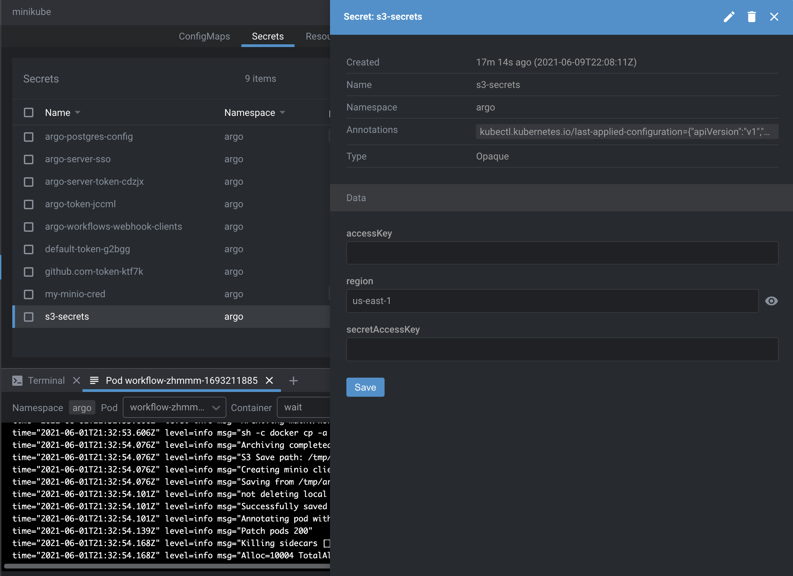

## Local Workflow


To run the workflow sample we'd need to have a minikube with installed Argo Workflows.

```bash
# check that the yaml file is valid
$ argo submit workflow-one.yaml --dry-run -o yaml
# submit the workflow
$ argo submit -n argo workflow-one.yaml --watch 
```

### S3 Credentials configuration

You may set it via Lens:

* namespace: **argo**
* secrets name: **s3-secrets**
  * keys:
    * **accessKey**
    * **secretAccessKey**
    * **region**


