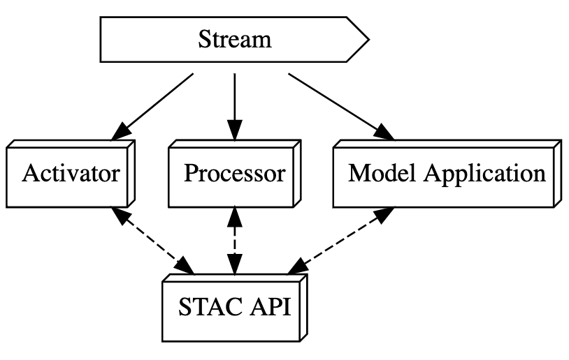
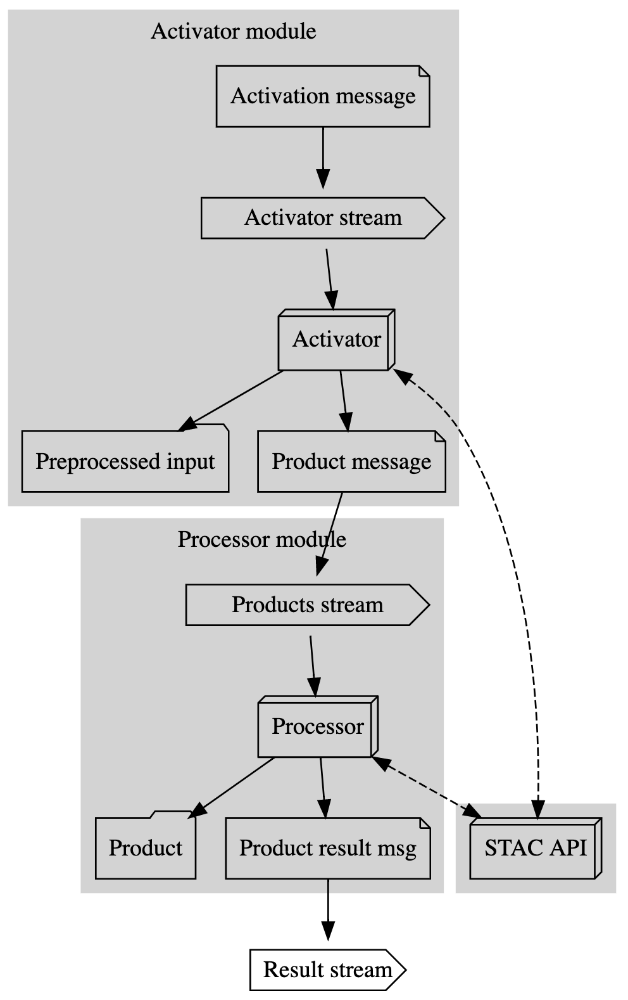
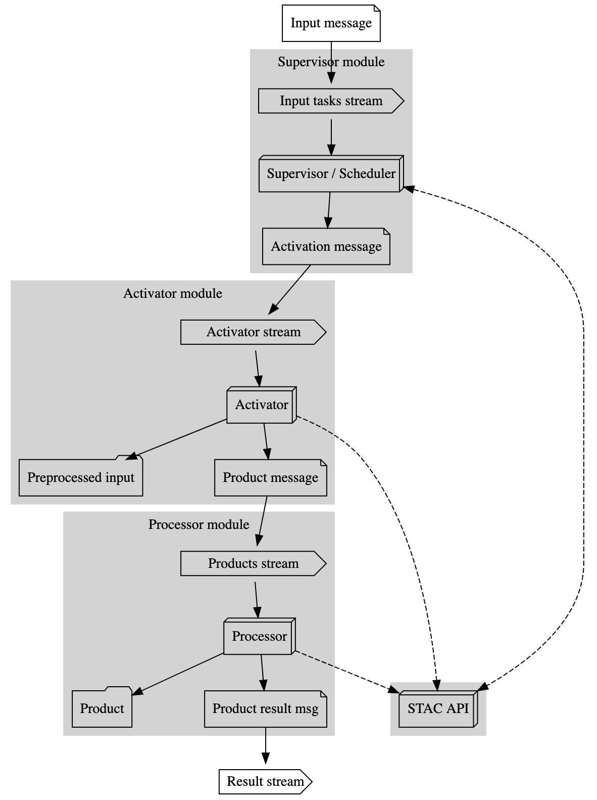

## Arch Draft v1

This document is not attached to any existing technologies.

### Context

For a while there has been a need in a raster processing pipeline. Originally, GeoTrellis (v1.0.0+) was mostly designed 
towards batch processing and towards large jobs on scale. Scaling was achieved via Spark and its inbuilt functionality to distribute 
data and tasks across the allocated cluster. However, it turned out that such usecase is not that popular and it is a very often that clients
may not have such cluster capacities or don't need to process such data amount at the same time. A more usual pipeline, that almost all raster companies (i.e. Planet) have, is an on demand preprocessing and / or processing.

[Back in 2016](https://github.com/locationtech/geotrellis/pull/1936) we have already tried to refactor the GeoTrellis ingest process and make it more iterative, since there was a client interset in ingesting large datasets by portions. That was a not succesfull experience though (in terms of the API).

We had a Farmers Edge contract where the task was to implement a consumer that would process rasters basing on the input messages on demand, and deliver results into STAC and AzureFS. That was a succesfull integration into their system that processes now 9000 Orthotiles a day and were over 800k products per hour created (products here is a cropped / resampled input + cloud removal (ML) + the actual peoduct computation (i.e. NDVI, PCA)).

The current FFDA project also represents an on demand processing flow where the processing (imagery download + predictions) happens basing on the input task grid. With the help of the Raster Vision Command it is possible to schedule and lunch such jobs on AWS Batch.

This project also requires to _develop imagery processing pipeline_ with the following requirements (Part 4. Phase II Work Plan, Develop Imagery Processing Pipeline):
* Develop Workflow Configuration (declarative workflow configuration)
* Develop New Scene Analysis (processing of new hyperspectral imagery as it becomes available in response to an external event)
* Develop On-Demand Analysis (on demand analysis of a desired type, analysis here is oil spill detetion, tree mortality)
* Develop Publish Workflow (catalog with results)
* Record Data Provenance Metadata (record provenance metadata in the STAC items)

#### Assumptions

* Input sources can vary (the system should not be tight to a single source)
* Products can vary (oil spill, tree mortality) and can use different sources
* Both preprocessing of input and processing should be scalable on demand
* AVIRIS Source is the only available dataset at this point
* There are no requirements on the throughput
* Target both constant messages stream and non constant messages stream
* At least preprocessing (activation) and processing modules should exist
* Ad-hoc modules invocation that doesn't neccesarily mean scheduling

#### Options

1. To follow the known path, and to build a system similar to one build in terms of FFDA. That would require non trivial, but exsiting instruments interaction and it would be another FFDA project with its benefits and issues.

2. To build an event driven processing pipeline which does not exsit yet. All the usecases above can be generalized and consolidated. The general idea is to build a composable and simple at the same time system that would consist of independent (or weakly dependent) modules. Modules itself can be written in any languages and communication between modules can be provided only through the messages stream. Each module can only process the input message if possible and in this model there is no "branching". Each module listens to its own topic and processes or tries to process all messages.

The second option is described in the sections below.

### The general view, streams, modules, metadata

#### Legend
* STAC API: rest service that implements stac api spec (in this case it would be Franklin).
* Module: messages consumer
* Stream: a stream of messages that modules would consume (in other words modules are stream consumers)
* Activator: module that preprocesses data
* Processor: module that produces _products_ (i.e. oil spill, tree mortality) from the preprocessed data

### A more detailed view, a flow diagram

#### Activator

Activator is a module that is responsible for preprocessing of the input raw (i.e. AVRIS) files.

1. It accepts the activation message (that can be i.e. AVRIS STAC item id with some extra metadata).
2. Queries STAC API and retrieves RAW Items from the catalog basing on the message parameters. It can also skip doing anything in case the preprocessed result is already in the catalog.
3. Runs preprocessing which can be downloading of neccesary assets from the AVRIS FTP, converting it into an appropriate format (i.e. TIFF) if neccesary.
4. Uploads the "Preprocessed output" on S3.
5. Generates the corresponding metadata that would be added into the STAC Catalog through the STAC API.
6. Sends the result message back into the stream. This can be only an alert message or it can send message directly into the next (product) module queue.

#### Processor

Processor is a module that is responsible for the actual product generation. Product here is the result of applying HSI tooling and is any derivative that is build from the input Activated data.

1. It accepts the product processing message (i.e. product name, input preprocessed scene ids).
2. Queries STAC API and retrieves PreProcessed Items from the catalog basing on the message parameters. It can also skip doing anything in case the result product is already in the catalog.
3. Applies neccesary transofrmations to the corresponding preprocessed data (i.e. AVRIS preprocessed scenes).
4. Uploads all result on S3.
5. Generates the corresponding metadata that would be added into the STAC Catalog through the STAC API.
6. Sends the result message back into the stream. This can be only an alert message or it can send message directly into the next (product) module queue.

#### A more detailed view, a flow diagram (with supervisor)

The reasonable question is should there be some supervisor that schedules the input user messages and sends messages into an appropriate queue. Supervisor is intentionally moved out of this diagram and it is probably on the application level and not a first citizen of this streaming application itself.

### Next steps

The next step would be to map the described high level diagram to the exsiting set of tools.

* Architecture and execution, what tools should be used to describe the diagram and to execute it
  * AWS Step function, airflow, nextflow
  * AWS Batch or K8S
* Stream selection
  * Kafka, SQS, Pulsar
* MVP
  * Build some working prototype with activator and processor
  * The goal is to look at how viable the proposed architure would be, what are the issues
  * Determine how modules can interact or should they interact with each other
* Consumers abstraction
  * In the proposed architecture it is not clea how the processor should be implemented
  * It is possible to implement a generic consumer that would be responsible for the application
