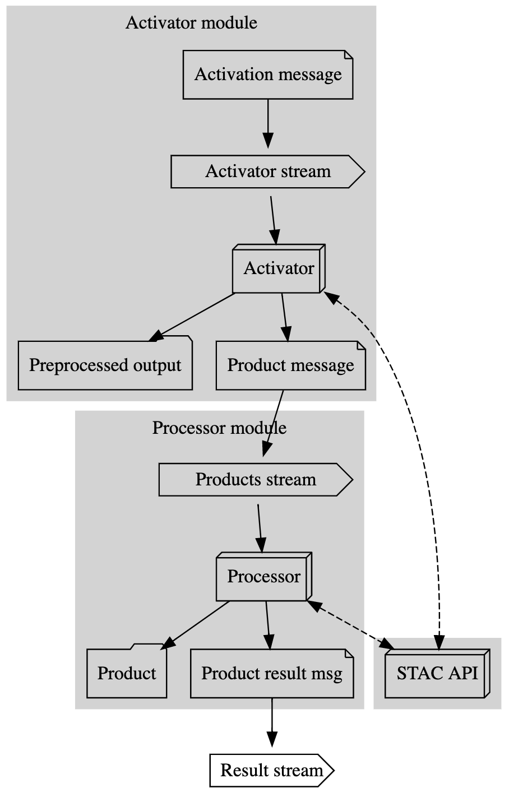

# Arch Draft v1

_The goal of this document is not to propose an architecture, but to describe an assumption that we can follow towards building it._

## Context

The goal of this project is to _develop hyperspectral imagery processing pipeline_.
While the project has reference use cases it we do not if the ultimatly they will be relevant to a potential cilent.
The overarching goal is to imporove our ability to cheaply and efficiently iterate on a number of potential use cases.
As such this project seeks to develop a reference architecture that can enable us to do that.

Based on our work in phase 1 the proposal outlines the following taks and requirements (Part 4. Phase II Work Plan, Develop Imagery Processing Pipeline) for that reference architecture:

### Develop New Scene Analysis

This is first model use case: AVIRIS flight to detect areas inundated with oil spill

 - a new hyperspectral imagery becomes available
 - an external event is generated and received by the system
 - this even triggers one or more asyncronous processes that may ultimatly result in production of derived data products
 - system produces an event when products are finally generated, alerting the users

### Develop On-Demand Analysis

This is the second model use case: Azavea requests production of dead trees layer

- a request for tree mortaility product at AOI gets made
- relevant HSI scenes are identified from catalog
- if not already available, those HSI scenes are downloaded and staged
- scenes are pre-processed to generate additional feature rasters
- RasterVision model is applied, generating tree mortality rasters
- system produces an event reporting success or failure of the job

### Develop Workflow Configuration

There should be some form of succinct and flexible configuration/script for the entire workflow.
When development new client use cases we should be able to use workflow configuration to sketch out and document
the processing requirements for the new use case before fully implementing it.
It is assumed that without this requirement the tendency will be to develop a very specific system that may not be easily reconfigured.

### Develop Publish Workflow

A lot of system output will be during development process or for internal consumption.
However, the pubish workflow considers how data products and their metadata can be published for external consumers.
Not every data product generated by the system must be published in this manner.

### Record Data Provenance Metadata

Both final and intermidate datasets produced by this system should include metadata that identifies both the process
and the inputs used in its creation. This information is expected to be used both for debugging and producability.

## Oil Detection Use Case

Here we present a high-level diagram of oil spill detection workflow in more detail.
Because system components must work asyncronsly we adopt message passing model in this diagram.

#### Component Diagram

#### Data Flow Diagram

#### STAC API

During the pipeline execution there would be a need to store input and output metadata. At this point, it is already a selected option and is one of the proposal requirements. Franklin implements STAC API Spec that fully covers our usecase.

#### Activator

Activator is a module that is responsible for preprocessing of the input raw (i.e. AVRIS, Planet) files. AVRIS is stored on FTP encoded into archives and definitely of these purposes there is a need in a preprocessing step.

1. It accepts the activation message (that can be i.e. AVRIS STAC item id with some extra metadata).
2. Queries STAC API and retrieves RAW Items from the catalog based on the message parameters. It can also skip doing anything in case the preprocessed result is already in the catalog.
3. Runs preprocessing which can be downloading of necessary assets from the AVRIS FTP, converting it into an appropriate format (i.e. TIFF) if necessary.
4. Uploads the "Preprocessed output" on S3.
5. Generates the corresponding metadata that would be added into the STAC Catalog through the STAC API.
6. Sends the result message back into the stream. This can be only an alert message or it can send message directly to the next (product) module.

#### Processor

Processor is a module that is responsible for the actual product generation. Product here is the result of applying HSI tooling and is any derivative that is build from the input Activated data.

1. It accepts the product processing message (i.e. product name, input preprocessed scene ids).
2. Queries STAC API and retrieves PreProcessed Items from the catalog basing on the message parameters. It can also skip doing anything in case the result product is already in the catalog.
3. Applies necessary transformations to the corresponding preprocessed data (i.e. AVRIS preprocessed scenes).
4. Uploads all results on S3.
5. Generates the corresponding metadata that would be added into the STAC Catalog through the STAC API.
6. Sends the result message back into the stream. This can be only an alert message or it can send a message directly to the next (product) module.

## Evaluation criteria / non-functional requirements

At this time we don't know exactly what technology or architecture will fit project requirements.
It is expected that there will be a perioud of exploration and evaluation of possible alternatives.
Here we provide some non-functional requirements based on what we already know about the problem domain.
These should be addressed in subsequent techonlogy evaluation ADRs.
The final system architecture will undoubtably have to be a compromise among these.

1. General purpose raster processing system
    - Input sources can vary. While primary input will be raster data we can not restrict it to a single data source.
    - Output data products will vary. Initial use case describes oil spill detection and tree mortailty map.
    Ultimatly the system should accomidate variaty of data products.

2. Scalability
    - Should be able to work with relatively large inputs. Single input scene may be larger than 8Gb.
    - We don't expect that system would be in a constant use and the static cost
      - stand-by cost of a system should be minimized

3. Modularity
    - It should be possible to re-use individual processing steps and recombine them to produces no data products.
    - Components independence reduces complexity of development and should allow to recombine components in somewhat order that increases the reusability of the system

4. Logging and Tracing
    - System should have accessible and usable logging that allows tracing of process execution and failure.

5. Low Latency
    - Start-up and warm-up times should be minimized
    - This is not real-time system but end-to-end execution time should be minimized.

6. Heterogeneous execution environment
    - Implementation of components is not limited to a single language
    - Should be easy enough to start diagnosing the issue and to have a simple development cycle

7. Development Workflow
   - Development should ergonimic, with emphasis on minimizing the iteration cycle.
   - Individual processing steps should be executable outside of the overall workflow to aid development and debugging process.
   - Logging and tracing information has to be easily available for remote executions

## Background

Scalable general purpose raster processing system has been target of previous development efforts.
This section highlights some of them with lessons learned that relate to this project.

### GeoTrellis
Originally, GeoTrellis (v1.0.0+) was designed towards batch processing of raster data at scale. Scaling was achieved via Apache Spark and its functionality to distribute data and tasks across a cluster.
We found that batch workflow required us to load all relevant raster data into memory of a large cluster. However, many uses cases are better served by smaller incremental jobs.

Additionally, start-up time for a cluster on AWS EMR is high (15 minutes).
Maintaining a running cluster is cost prohibitive and auto-scaling one has been challanging.

### AWS Batch in FFDA Contract
The FFDA project also represents an on demand processing flow where the imagery download and predictions happens on AWS Batch using Raster Vision pipelines.

In contrast to AWS EMR the AWS Batch handles auto-scaling well.
However, debugging multi-stop jobs is hard and testing interation time is high.

### Spark Streaming in Farmers Edge Contract
Farmers Edge developed an on demand, event driven, raster processing system. In response to stream of user reqeusts the system downloads the neccesary satelitle imagery and generates derived products (NDVI, PCA, field clipping) for given field boundaries as the result.

Initially this system was implemented in AWS Batch with each user request sbumitting multiple jobs.
The client was unhappy with the system performance. Critically, the system didn't delivery sufficient thoughput. Additionaly, tasks would sporadically fail and they could not be rescheduled. Debugging these failures was also challenging for variety of reasons.

Replacement system was implemented as Spark Streaming application deployed on K8s cluster.
The client wanted to keep deployment through Docker containers and to avoid vendor lock-in.
The spark streaming system has better throughput because spark mini-batch stream resulted in lower
amortized overhead per user request.
Debugging and failure retry was also improvied because spark can aggregate job status across nodes.
Development expirience was much improved because of K8s/Docker integration.

The system now processes 9000 Orthotiles a day with over 800k field products per hour created.
However, this architecture had issues with auto-scalability and requires to have a constantly running cluster.

### Conclusion

We are not clear yet what technologies to use and what architecture to implement. The next step would be to map the architecture assumption to the existing set of tools to prevent us from the unnecessary wheel reinvention within the given set of constraints.

## Next steps

* **Mock up the architecture and the pipeline execution**
  * Using [AWS Step functions](https://github.com/azavea/nasa-hyperspectral/issues/28) and [Nextflow](https://github.com/azavea/nasa-hyperspectral/issues/17)
* **MVP**
  * Build some working prototype with activator and processor
  * The goal is to look at how viable the proposed architecture would be, what are the issues
  * Determine how modules can interact or should they interact with each other
