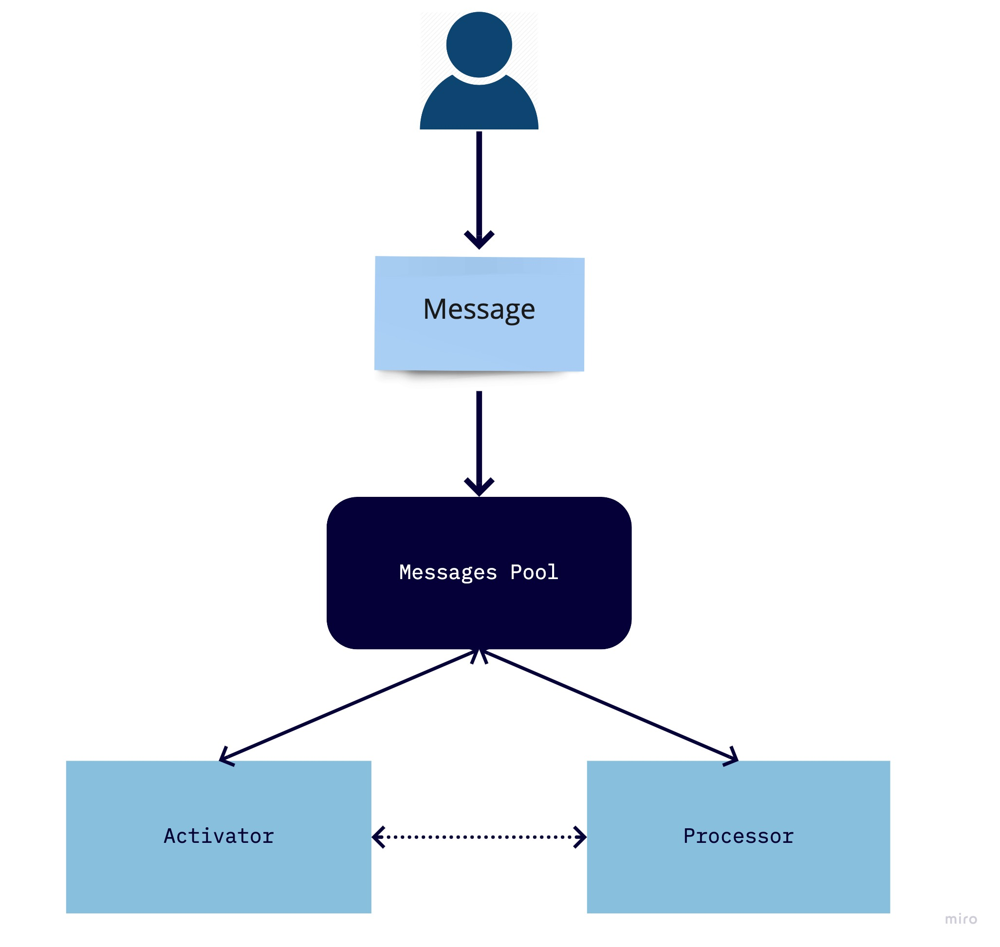

# Context

In the [Arch Document](https://github.com/azavea/nasa-hyperspectral/blob/feature/arch/docs/arch/v1/README.md) an imagery processing pipeline is described. There is made an assumption that Nextflow may be used for the pipeline orchestration.

This document is an attempt to mock up the pipeline architecture using Nextflow.

The mock up pipeline consists of two applications: `Activator` and `Processor` (see the [Diagram](#diagram)). Here, `Activator` and `Processor` are applications that consume the input message (JSON formatted) and send it into the destination.

At a very high level, the mock up workflow is going to look this way:

1. User generates the initial `Activator` message
2. `Activator` reacts to the incoming message, prints it, and sends message into `Processor`
3. `Processor` reacts to the incoming message and prints it

It can be visualized with the following [Diagram](#diagram):

## Diagram

// copied from docs
Nextflow is a reactive workflow framework and a programming DSL that eases the writing of data-intensive computational pipelines.

In practice a Nextflow pipeline script is made by joining together different processes. Processes are executed independently and are isolated from each other, i.e. they do not share a common (writable) state. The only way they can communicate is via asynchronous FIFO queues, called channels in Nextflow.

