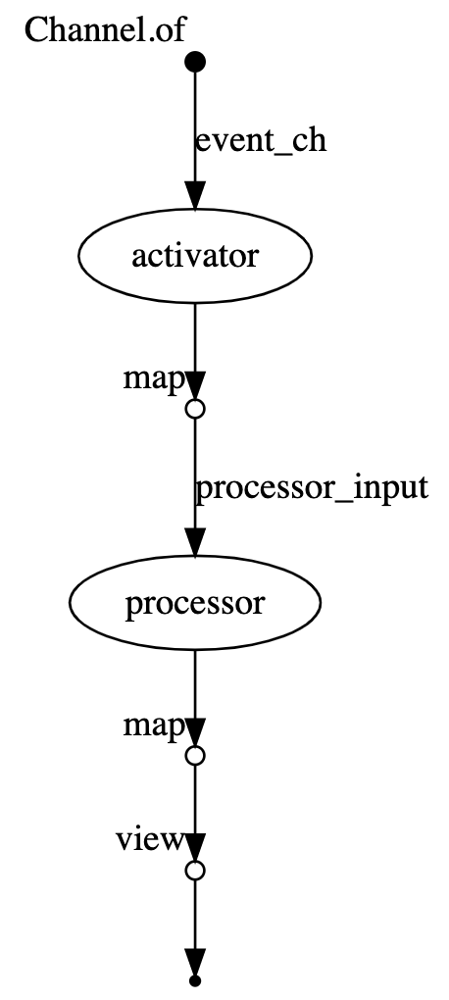
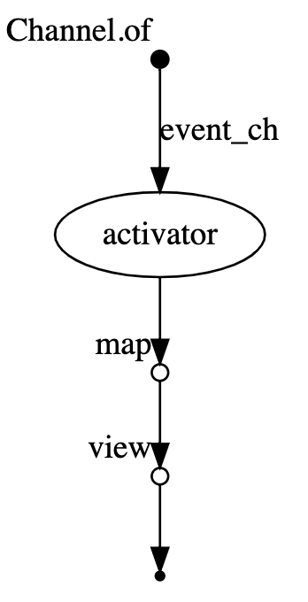
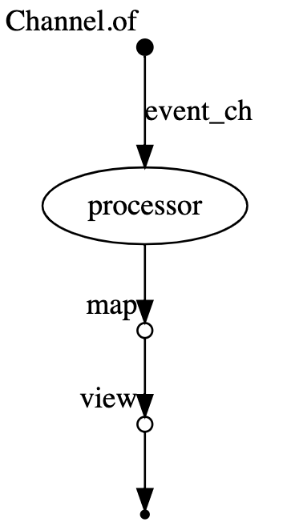
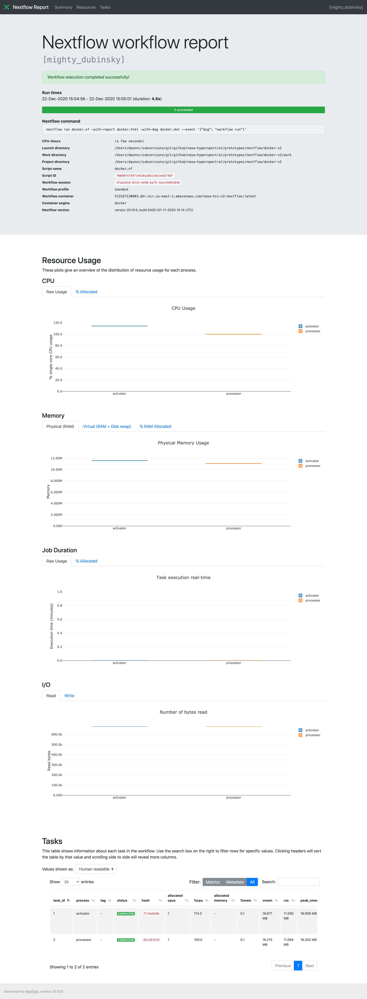

# Context

In the [Arch Document](https://github.com/azavea/nasa-hyperspectral/blob/feature/arch/docs/arch/v1/README.md) an imagery processing pipeline is described. There is made an assumption that Nextflow may be used for the pipeline orchestration.

This document is an attempt to mock up the pipeline architecture using Nextflow.

The mock up pipeline consists of two applications: `Activator` and `Processor` (see the [Diagram](#diagram)). Here, `Activator` and `Processor` are applications that consume the input message (JSON formatted) and send it into the destination.

At a very high level, the mock up workflow is going to look this way:

1. User generates the initial `Activator` message
2. `Activator` reacts to the incoming message, prints it, and sends message into `Processor`
3. `Processor` reacts to the incoming message and prints it

It can be visualized with the following [Diagram](#diagram):

## Diagram


## Nextflow

Nextflow is a reactive workflow framework and a programming DSL that eases the writing of data-intensive computational pipelines.

In practice a `Nextflow` pipeline script is made by joining together different `processes`. `Processes` are executed independently and are isolated from each other, i.e. they do not share a common (writable) state. The only way they can communicate is via **asynchronous FIFO queues, called channels** in `Nextflow`. The composition of `processes` is called `workflow`.

Along with the `workflow` descirption DSL `Nextflow` provides an abtraction over [executors](https://www.nextflow.io/docs/latest/executor.html). `Executor` is the component that determines the system where a pipeline process is run and supervises its execution. The executor provides an abstraction between the pipeline processes and the underlying execution system. This allows you to write the pipeline functional logic independently from the actual processing platform. 

In other words the same `Nextflow` pipeline can be launched in a different execution environment (local, local docker, aws batch, k8s, etc) with minimal configuration changes only.

## Solution

`Nextflow` allows directly to define the pipeline that consists of multiple steps and more over to define 
some logic around selecting what steps should be skipped or forced basing on the `workflow` input parameters.

```bash
// In this example we used the new Nextflow DSL
// https://www.nextflow.io/docs/latest/dsl2.html
nextflow.enable.dsl=2

process activator { 
  // all nextflow porcesses in this example would be containerized
  container '513167130603.dkr.ecr.us-east-1.amazonaws.com/nasa-hsi-v2-nextflow:latest' 
  // error strategy specification
  errorStrategy 'retry'
  maxErrors 5

  // process input argument
  input:
  val event

  // process output
  output:
  file 'activator_event.json'

  // process execution script
  shell:
  '''
   python /workdir/activator.py '!{event}'
  '''
}

process processor {
  // all nextflow porcesses in this example would be containerized
  container '513167130603.dkr.ecr.us-east-1.amazonaws.com/nasa-hsi-v2-nextflow:latest' 
  // error strategy specification
  errorStrategy 'retry'
  maxErrors 5

  input:
  val event

  output:
  file 'processor_event.json'

  shell:
  '''
  python /workdir/processor.py '!{event}'
  '''
}

workflow {
  // variables init
  params.event = ''
  params.event_type = ''

  event_ch = Channel.of(params.event)
  
  // describe different workflow modes
  if(params.event_type == 'activator') {
    activator(event_ch)
    activator.out.map(file -> file.text).view()
  } else if (params.event_type == 'processor') {
    processor(event_ch)
    processor.out.map(file -> file.text).view()
  } else {
    activator(event_ch)
    processor_input = activator.out.map(file -> file.text)
    processor(processor_input)
    processor.out.map(file -> file.text).view()
  }
}

```

* [Activator Sources](docker/batch/activator.py)
* [Processor Sources](docker/batch/processor.py)
* [.nextflow.config](docker/.nextflow.config)
* [docker.nf](docker/docker.nf)

### How to run

_NOTE: All diagrams in this section are generated via nextflow and converted into png format._

To run this `Nextflow` script enter the [docker directory](./docker) and run `make nextflow-run` command:

```bash
nextflow run docker.nf -with-report docker.html -with-dag docker.dot --event '{"msg": "workflow run"}'

# N E X T F L O W  ~  version 20.10.0
# Launching `docker.nf` [admiring_galileo] - revision: a4c163e45d
# executor >  local (2)
# [8a/f3141d] process > activator (1) [100%] 1 of 1 ✔
# [c7/9ef8c2] process > processor (1) [100%] 1 of 1 ✔
# {"msg": "workflow run"}
```

The command above generates repot, execution graph and passes the `event` parameter into the `workflow` as input.



It is also to run activator only process via the `make nextflow-run-activator` command:

```bash
nextflow run docker.nf -with-report docker.html -with-dag docker.dot --event '{"msg": "activator run"}' --event_type 'activator'

# N E X T F L O W  ~  version 20.10.0
# Launching `docker.nf` [awesome_meitner] - revision: a4c163e45d
# executor >  local (1)
# [6e/64a6bd] process > activator (1) [100%] 1 of 1 ✔
# {"msg": "activator run"}
```



Or to run processor process via the `make nextflow-run-processor` command:

```bash
nextflow run docker.nf -with-report docker.html -with-dag docker.dot --event '{"msg": "processor run"}' --event_type 'processor'

# N E X T F L O W  ~  version 20.10.0
# Launching `docker.nf` [exotic_carlsson] - revision: f0898f4769
# executor >  local (1)
# [b1/a7d14f] process > processor (1) [100%] 1 of 1 ✔
# {"msg": "processor run"}
```



Report output example (available as HTML file):



### Execution environment

The example above is located in the [docker directory](./docker) and runs locally. Each processor in this case is represented as a separate docker container. To run the same script on `AWS Batch` it is neccesary to add an appropriate `Nextflow` configuration into the [.nextflow.config](./docker-aws/.nextflow.config) file. All AWS Batch Examples are located in the [docker-aws](./docker-aws) directory.

### Deployment

For the AWS Deployment purposes we'd need to explore more. We'd need at least a seaprate Nextflow batch machine that would trigger a set of dependent AWS Batch jobs. AWS has resources with examples of the `Nextflow` deployment:

* [AWS Nextflow quickstart](https://aws.amazon.com/quickstart/biotech-blueprint/nextflow/)
* [AWS Genomics Nextflow overview](https://docs.opendata.aws/genomics-workflows/orchestration/nextflow/nextflow-overview/)
* [AWS Genomics Nextflow Workshop](https://github.com/aws-samples/aws-genomics-nextflow-workshop/blob/master/docs/index.md)


## Consequences

`Nextflow` looks like a solid tool for this pipeline orchestration. It is extremely convenient to use and caused no issues in local environment and switch between the local execution, local docker execution and AWS Batch is indeed seamless. In addition, It generates all metrics as well as logs and generates the result execution graph. There is still an open question how to deploy it better and would it add a desired transparency into the pipeline description and its results introspections. However, it definitely allows to overcome the AWS Vendor lock and behaves predictable.
