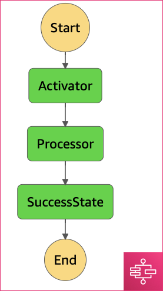
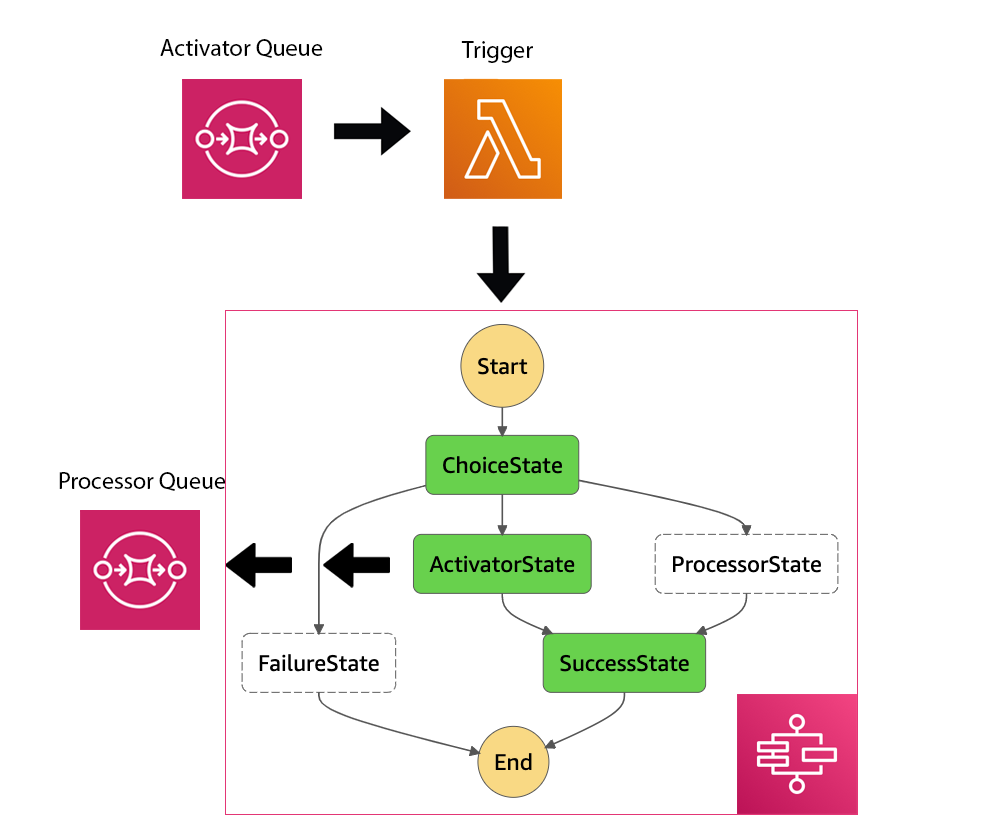
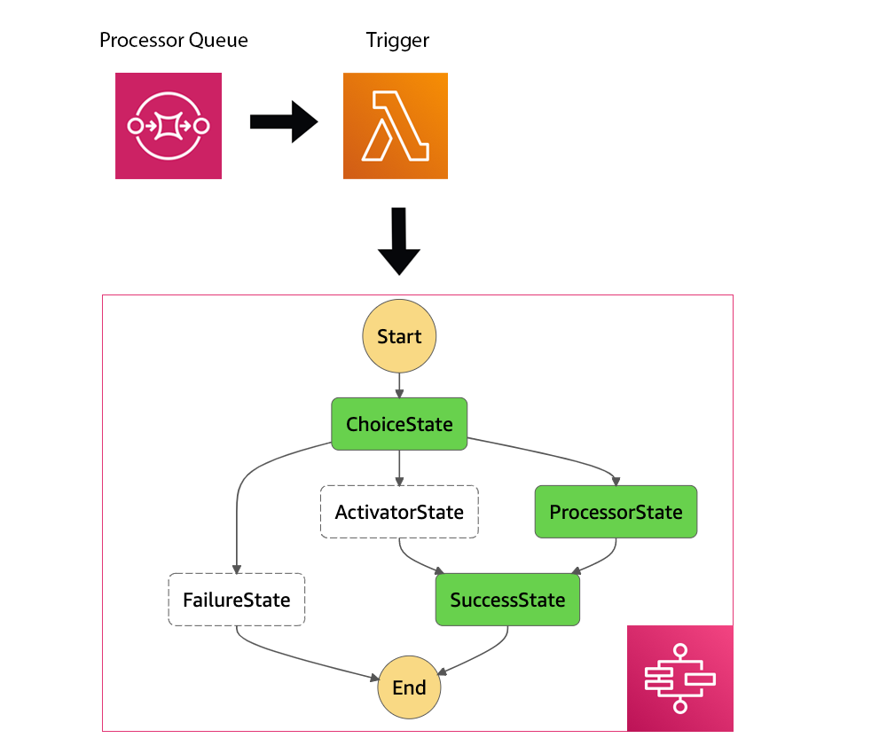

# Context

In the [Arch Document](https://github.com/azavea/nasa-hyperspectral/blob/feature/arch/docs/arch/v1/README.md) an imagery processing pipeline is described. There is made an assumption that AWS Step Functions may be used for the pipeline orchestration.

This document is an attempt to mock up the pipeline architecture using AWS Step Functions. It describes a small research and development of the pipeline via AWS Step Functions, AWS Lambda Functions, AWS Batch, and SQS.

The mock up pipeline consists of two applications: `Activator` and `Processor` (see the [Diagram](#diagram)). Here, `Activator` and `Processor` are applications that consume the input message (JSON formatted) and send it into the destination.

At a very high level, the mock up workflow is going to look this way:

1. User generates the initial `Activator` message
2. `Activator` reacts to the incoming message, prints it, and sends message into `Processor`
3. `Processor` reacts to the incoming message and prints it

It can be visualized with the following [Diagram](#diagram):

## Diagram


## Solutions overview

In sections below several attempts to implement the architecture mock up are described. Each section contains a working standalone example of the pipeline mock up. The goal here is to get familiar with AWS Step Functions as well as to get understanding of its limitations.

### Exploring AWS Step Functions

AWS Step Functions is a serverless function orchestrator that makes it easy to sequence AWS Lambda functions and multiple AWS services into applications. The most straightforward way to use AWS Batch Functions is to use it with AWS Lambda functions. AWS Step Functions is a State Machine and described using the Amazon States Language.

**Some of AWS Step Functions Benefits**:
* Serverless: there is no need to manage the running of the source code. AWS step functions provides the infrastructure for it.
* Native constructs: AWS Batch introduces native constructs like re-try logic with exponential back-off, parallelization, logic nodes.
* Visualization: the state machine can be seen and is easy to understand. It is not only seen visually, but also aggregates all logs, input and outputs in a single place. That makes it easy to develop and introspect.

We'll start with describing a State Machine of two AWS Lambda functions `Activator` and `Processor`, where `Activator` accepts an incoming message and sends it into the `Processor` AWS Lambda function.

```javascript
{
  "Comment": "HSI Pipeline prototype",
  "StartAt": "Activator",
  "States": {
    "Activator": {
      "Type" : "Task",
      "Resource": "${activator_arn}", // AWS Lambda arn
      "Next": "Processor"
    },
    "Processor": {
      "Type" : "Task",
      "Resource": "${processor_arn}", // AWS Lambda arn
      "Next": "SuccessState"
    },
    "SuccessState": {
      "Type": "Succeed"
    }
  }
}
```



* [Activator Lambda Sources](lambda-seq/lambdas/activator.py)
* [Processor Lambda Sources](lambda-seq/lambdas/processor.py)

AWS Step Functions introduce visualization of steps and make it easy to track and introspect the pipeline execution process. More over, if the state machine consists of two AWS Lambda functions, these two functions can message exchange directly and the output of the previous step would be an input for the next one.

Terraform configuration to run this test project is located in the [lambda-seq](./lambda-seq) directory.

### Exploring AWS Batch usage with AWS Step Functions

In the previous section the State Machine of two AWS Lambda Functions is described. However, our applications most likely would require to have extra dependencies, more memory, and CPU rather than it is available for AWS Lambda functions. In addition, it may require longer execution times.

State Machine can work with AWS Batch jobs. It is possible to chain and mix AWS Batch and AWS Lambda execution.

```javascript
{
  "Comment": "HSI Pipeline prototype",
  "StartAt": "Activator",
  "States": {
    "Activator": {
      "Type": "Task",
      "Resource": "arn:aws:states:::batch:submitJob.sync",
      "Parameters": {  
        "JobDefinition": "${job_definition_arn}", // AWS Batch Job definition
        "JobName": "ActivatorBatchJob",
        "JobQueue": "${queue_arn}", // AWS Batch Job queue
        "Parameters.$": "$.parameters",
        "ContainerOverrides": {
          "Vcpus": 1
        }
      },
      "Next": "Processor"
    },
    "Processor": {
      "Type" : "Task",
      "Resource": "${processor_arn}", // AWS Lambda arn
      "Next": "SuccessState"
    },
    "SuccessState": {
      "Type": "Succeed"
    }
  }
}

```


* [Activator Job Sources](lambda-batсh-seq/lambdas/activator.py)
* [Processor Lambda Sources](lambda-batсh-seq/lambdas/processor.py)

It turned out, that the output of the AWS Batch job is the _execution status_ described as a JSON message. This message is sent into the AWS Lambda function as an input. It means that it is not possible to have the control over the direct message exchange between AWS Batch states like and it would be required to use a separate message exchange system.

Terraform configuration to run this test project is located in the [lambda-batch-seq](./lambda-batсh-seq) directory.

### Exploring AWS Batch usage with AWS Step Functions and communication via SQS

AWS Batch functions can't send messages to the next step function state. To overcome this limitation it is possible to use SNS / SQS.

```javascript
{
  "Comment": "HSI Pipeline prototype",
  "StartAt": "Activator",
  "States": {
    "Activator": {
      "Type": "Task",
      "Resource": "arn:aws:states:::batch:submitJob.sync",
      "Parameters": {  
        "JobDefinition": "${job_definition_arn}", // AWS Batch Job definition
        "JobName": "ActivatorBatchJob",
        "JobQueue": "${queue_arn}", // AWS Batch Job queue
        "Parameters.$": "$.parameters",
        "ContainerOverrides": {
          "Vcpus": 1
        }
      },
      "Next": "Processor"
    },
    "Processor": {
      "Type" : "Task",
      "Resource": "${processor_arn}", // AWS Lambda arn
      "Next": "SuccessState"
    },
    "SuccessState": {
      "Type": "Succeed"
    }
  }
}

```


* [Activator Job Sources](lambda-batсh-seq-sqs/lambdas/activator.py)
* [Processor Lambda sources](lambda-batсh-seq-sqs/lambdas/processor.py)

The `Activator` step can send a message into SQS basing on the initial (SQS) input. The `Processor` step would consume the message from the queue. However, in this scheme it is unclear how the State Machine execution would be triggered and it doesn't add any transparency into the flow. The ordering of execution as well as the message consumption is not guaranteed. If we'll pretend that the State Machine is triggered by the SQS trigger, there is a chance that `Processor` would process some message that is not the output of the `Activator` of the same state machine. It can process an older message that appeared in the queue from the other state machine `Activator` step.

Terraform configuration to run this test project is located in the [lambda-batсh-seq-sqs](./lambda-batсh-seq-sqs) directory.

### An alternative AWS Batch, SQS, and AWS Step Functions fusion

From the previous section it is clear that the previous attempt does not add any clarity and only adds extra complexity to the execution flow.

However, it is still possible to take advantage of `AWS Step Functions`.

```javascript
{
   "Comment":"HSI Pipeline prototype",
   "StartAt":"ChoiceState",
   "States":{
      "ChoiceState":{
         "Type":"Choice",
         "Choices":[ // determine the type of a message
            {
               "Variable":"$.eventSourceARN",
               "StringEquals":"${activator_queue_arn}",
               "Next":"ActivatorState"
            },
            {
               "Variable":"$.eventSourceARN",
               "StringEquals":"${processor_queue_arn}",
               "Next":"ProcessorState"
            }
         ], // in case of receiving a message from an unknown queue
         "Default":"FailureState"
      },
      "ActivatorState":{
         "Type":"Task",
         "Resource":"arn:aws:states:::batch:submitJob.sync",
         "Parameters":{
            "JobDefinition":"${activator_job_definition_arn}", // AWS Batch Job definition
            "JobName":"ActivatorBatchJob",
            "JobQueue":"${queue_arn}", // AWS Batch Job queue
            "Parameters.$":"$.parameters",
            "ContainerOverrides":{
               "Vcpus":1
            }
         },
         "InputPath":"$",
         "ResultPath":"$.status",
         "Next":"SuccessState"
      },
      "ProcessorState":{
         "Type":"Task",
         "Resource":"arn:aws:states:::batch:submitJob.sync",
         "Parameters":{
            "JobDefinition":"${processor_job_definition_arn}", // AWS Batch Job definition
            "JobName":"ProcessorBatchJob",
            "JobQueue":"${queue_arn}", // AWS Batch Job queue
            "Parameters.$":"$.parameters",
            "ContainerOverrides":{
               "Vcpus":1
            }
         },
         "InputPath":"$",
         "ResultPath":"$.status",
         "Next":"SuccessState"
      },
      "FailureState":{
         "Type":"Fail",
         "Error":"DefaultStateError",
         "Cause":"No module to process messages from this topic!"
      },
      "SuccessState":{
         "Type":"Succeed"
      }
   }
}
```




* [State Machine trigger](sfn-sqs/lambdas/sfn_trigger.py)
* [Activator](sfn-sqs/batch/activator.py)
* [Processor](sfn-sqs/batch/processor.py)

SQS message triggers AWS Step Functions execution. The State Machine handles exceptions as well as a job execution. It visually shows what execution component was triggered and why, exposes logs, inputs, and outputs of each state.

Terraform configuration to run this test project is located in the [sfn-sqs](./sfn-sqs) directory.

### Stateless

As an alternative approach, it is possible to remove AWS Step Functions from the pipeline. The workflow can function through SQS triggers only:


* [Activator Trigger](stateless-batch/lambdas/activator.py)
* [Processor Trigger](stateless-batch/lambdas/processor.py)
* [Activator Job](stateless-batch/batch/activator.py)
* [Processor Job](stateless-batch/batch/processor.py)

Terraform configuration to run this test project is located in the [stateless-batch](./stateless-batch) directory.

## Consequences

It is definitely worth trying to use AWS Step Functions for this pipeline orchestration. There is an example that shows that it is possible to take advantage of AWS Step Functions benefits in [An alternative AWS Batch, SQS, and AWS Step Functions fusion](#an-alternative-aws-batch-sqs-and-aws-step-functions-fusion) section. However, if that would not be enough or would introduce more problems rather than benefits, we can always rely on triggers and orchestrate the pipeline via the [Stateless](#stateless) approach or via something else, that is not covered by this document.
