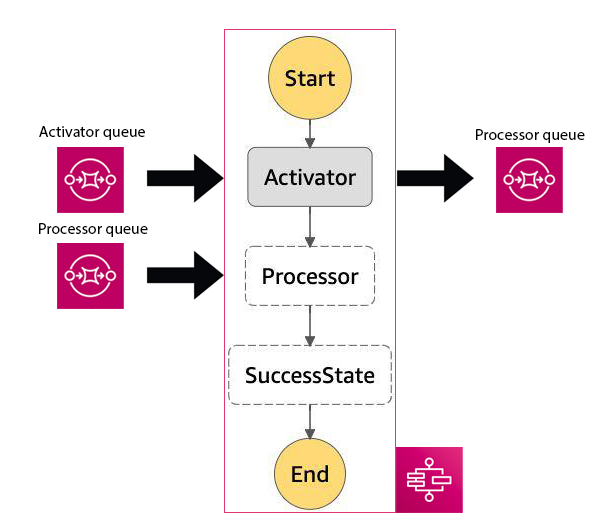

### Exploring AWS Batch usage with AWS Step Functions and communication via SQS

AWS Batch functions can't send messages to the next step function state. To overcome this limitation it is possible to use SNS / SQS.

```javascript
{
  "Comment": "HSI Pipeline prototype",
  "StartAt": "Activator",
  "States": {
    "Activator": {
      "Type": "Task",
      "Resource": "arn:aws:states:::batch:submitJob.sync",
      "Parameters": {  
        "JobDefinition": "${job_definition_arn}", // AWS Batch Job definition
        "JobName": "ActivatorBatchJob",
        "JobQueue": "${queue_arn}", // AWS Batch Job queue
        "Parameters.$": "$.parameters",
        "ContainerOverrides": {
          "Vcpus": 1
        }
      },
      "Next": "Processor"
    },
    "Processor": {
      "Type" : "Task",
      "Resource": "${processor_arn}", // AWS Lambda arn
      "Next": "SuccessState"
    },
    "SuccessState": {
      "Type": "Succeed"
    }
  }
}

```



* [Activator Job Sources](lambdas/activator.py)
* [Processor Lambda sources](lambdas/processor.py)

The `Activator` step can send a message into SQS basing on the initial input. The `Processor` step in this case would consume the message from the queue. However, in this scheme it is unclear how the state machine execution would be triggered and in fact it doesn't add any transparancy. The ordering of execution as well as the message consumption is not guaranteed. If we'll pretend that the State machine is triggered by the SQS trigger, there is a chance that `Processor` would process a message that is not the output of the `Activator` of the same state machine - it can process some older message, that appeared in the queue from the other state machine `Activator` step.

## How to start

```
terraform init
terraform plan -out plan.txt
terraform apply "plan.txt"
terraform destroy
```
