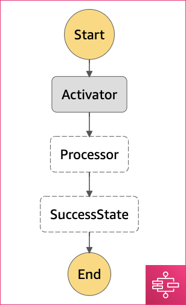

## Exploring AWS Batch usage with AWS Step Functions

In the previous section a State Machine of two AWS Lambda Functions is described. However, our applications most likely would require to have extra dependencies, more memory and cpu rather than it is available for AWS Lambda functions and may take longer execution times.

State Machine can work with AWS Batch jobs and it is possible to chain and mix AWS Batch and AWS Lambda execution.

```javascript
{
  "Comment": "HSI Pipeline prototype",
  "StartAt": "Activator",
  "States": {
    "Activator": {
      "Type": "Task",
      "Resource": "arn:aws:states:::batch:submitJob.sync",
      "Parameters": {  
        "JobDefinition": "${job_definition_arn}", // AWS Batch Job definition
        "JobName": "ActivatorBatchJob",
        "JobQueue": "${queue_arn}", // AWS Batch Job queue
        "Parameters.$": "$.parameters",
        "ContainerOverrides": {
          "Vcpus": 1
        }
      },
      "Next": "Processor"
    },
    "Processor": {
      "Type" : "Task",
      "Resource": "${processor_arn}", // AWS Lambda arn
      "Next": "SuccessState"
    },
    "SuccessState": {
      "Type": "Succeed"
    }
  }
}

```



* [Activator Job Sources](lambdas/activator.py)
* [Processor Lambda Sources](lambdas/processor.py)

It turned out, that the output of the AWS Batch job is the _execution status_ described as a JSON message. This message gets passed into the AWS Lambda function as an input. It means that it is not possible to have the control over messageы exchange between AWS Batch states and it would be required to use a seaprate messagе exchange system.

## How to start

```
terraform init
terraform plan -out plan.txt
terraform apply "plan.txt"
terraform destroy
```
