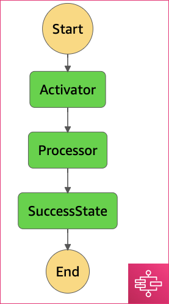

## Exploring AWS Step Functions

AWS Step Functions is a serverless function orchestrator that makes it easy to sequence AWS Lambda functions and multiple AWS services into applications. The most straightforward way to use AWS Batch Functions is to use it with AWS Lambda functions. AWS Step Functions is a state machine and described using the Amazon States Language.

**AWS Step Functions Benefits**:
* Serverless: there is no need to manage the running of the source code. AWS step functions provides the infrastructure for it.
* Native constructs: Batch intoroduces native constructs like re-try logic with exponential back-off, parallelization, logic nodes.
* Visuzalization: The state machine can be seen and is easy to understand. It is not only seen visually, but also aggregates all logs, input and outputs in a single place. That makes it easy to develop and introspect.

Let's descibe a State Machine of two AWS Lambda functions `Activator` and `Processor`, where `Activator` accepts an incoming event and sends it into the `Processor` AWS Lambda function.

```javascript
{
  "Comment": "HSI Pipeline prototype",
  "StartAt": "Activator",
  "States": {
    "Activator": {
      "Type" : "Task",
      "Resource": "${activator_arn}", // AWS Lambda arn
      "Next": "Processor"
    },
    "Processor": {
      "Type" : "Task",
      "Resource": "${processor_arn}", // AWS Lambda arn
      "Next": "SuccessState"
    },
    "SuccessState": {
      "Type": "Succeed"
    }
  }
}
```



* [Activator Lambda Sources](lambdas/activator.py)
* [Processor Lambda Sources](lambdas/processor.py)

AWS Step funcions introduces visualization of steps and makes it realy easy to track the pipeline execution process. More over, if the state machine consists of two AWS Lambda functions, these two functions can messages exchange directly and the output of the previous step would be an input for the next one.

## How to start

```
terraform init
terraform plan -out plan.txt
terraform apply "plan.txt"
terraform destroy
```
