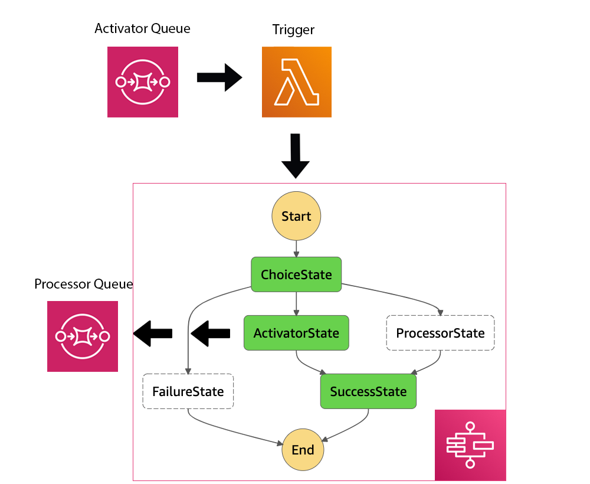
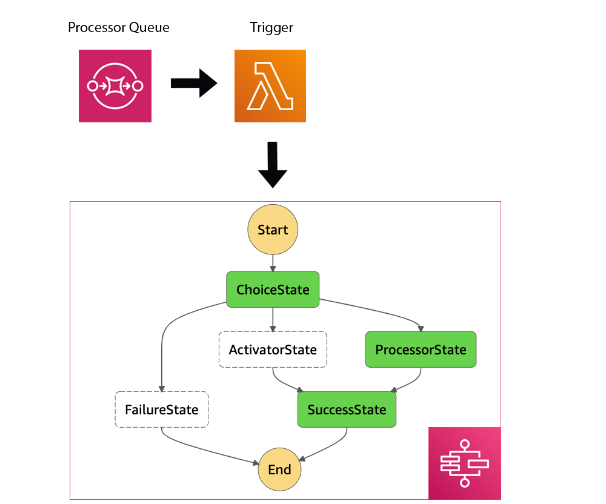

## An alternative AWS Batch, SQS, and AWS Step Functions fusion

Fom the previous section, it is clear that that attempt does not add any clarity and only adds extra complexity to the execution flow.

However, it is still possible to take advantage of `AWS Step Functions`.

```javascript
{
   "Comment":"HSI Pipeline prototype",
   "StartAt":"ChoiceState",
   "States":{
      "ChoiceState":{
         "Type":"Choice",
         "Choices":[ // determine the type of a message
            {
               "Variable":"$.eventSourceARN",
               "StringEquals":"${activator_queue_arn}",
               "Next":"ActivatorState"
            },
            {
               "Variable":"$.eventSourceARN",
               "StringEquals":"${processor_queue_arn}",
               "Next":"ProcessorState"
            }
         ], // in case of receiving a message from an unknown queue
         "Default":"FailureState"
      },
      "ActivatorState":{
         "Type":"Task",
         "Resource":"arn:aws:states:::batch:submitJob.sync",
         "Parameters":{
            "JobDefinition":"${activator_job_definition_arn}", // AWS Batch Job definition
            "JobName":"ActivatorBatchJob",
            "JobQueue":"${queue_arn}", // AWS Batch Job queue
            "Parameters.$":"$.parameters",
            "ContainerOverrides":{
               "Vcpus":1
            }
         },
         "InputPath":"$",
         "ResultPath":"$.status",
         "Next":"SuccessState"
      },
      "ProcessorState":{
         "Type":"Task",
         "Resource":"arn:aws:states:::batch:submitJob.sync",
         "Parameters":{
            "JobDefinition":"${processor_job_definition_arn}", // AWS Batch Job definition
            "JobName":"ProcessorBatchJob",
            "JobQueue":"${queue_arn}", // AWS Batch Job queue
            "Parameters.$":"$.parameters",
            "ContainerOverrides":{
               "Vcpus":1
            }
         },
         "InputPath":"$",
         "ResultPath":"$.status",
         "Next":"SuccessState"
      },
      "FailureState":{
         "Type":"Fail",
         "Error":"DefaultStateError",
         "Cause":"No module to process messages from this topic!"
      },
      "SuccessState":{
         "Type":"Succeed"
      }
   }
}
```




* [State Machine trigger](lambdas/sfn_trigger.py)
* [Activator](batch/activator.py)
* [Processor](batch/processor.py)

SQS message triggers AWS Step Functions execution. The State machine handles allows to handle exceptions as well as job execution. It visually shows what execution component was triggered and why, allows to introspect logs, input, and outputs of each state.

## How to start

```
terraform init
terraform plan -out plan.txt
terraform apply "plan.txt"
terraform destroy
```
