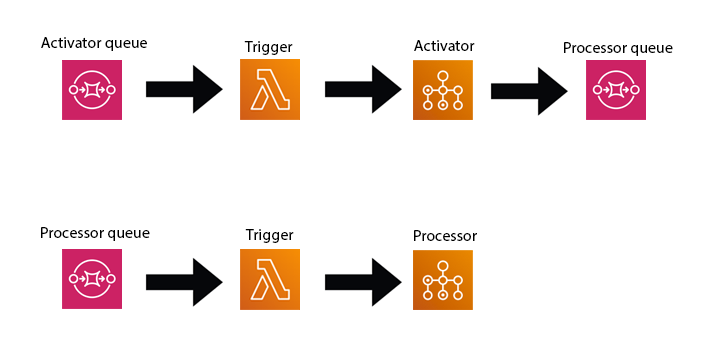

## Stateless

As an alternative, it is possible to remove AWS Step Functions from the pipeline at all. The workflow can function only through triggers:



* [Activator Trigger](lambdas/activator.py)
* [Processor Trigger](lambdas/processor.py)
* [Activator Job](batch/activator.py)
* [Processor Job](batch/processor.py)

## How to start

```
terraform init
terraform plan -out plan.txt
terraform apply "plan.txt"
terraform destroy
```
